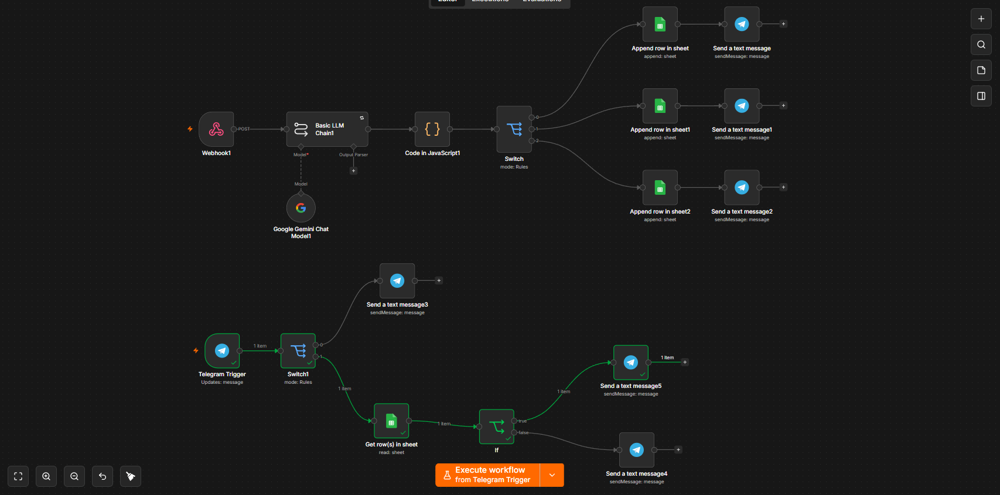

# 🤖 Sistema Automatizado de Justificación de Inasistencias
### Construido con n8n · Google Gemini AI · Telegram · Google Sheets

---

> **Automatización inteligente** que recibe solicitudes de justificación de inasistencia de estudiantes, las evalúa con IA, las registra y notifica el resultado en tiempo real vía Telegram — sin intervención humana en los casos claros.

---

## 📸 Evidencia del Flujo



---

## ⚙️ ¿Qué hace este proyecto?

Un estudiante llena un formulario web con su nombre, motivo de inasistencia y descripción. Desde ahí, el sistema:

1. **Recibe** la solicitud vía Webhook
2. **Evalúa** el caso con Google Gemini (IA)
3. **Clasifica** el resultado según nivel de confianza
4. **Registra** el caso en Google Sheets
5. **Notifica** al estudiante por Telegram con el veredicto

Si el caso es ambiguo, va directo a revisión manual. Si es claro, se aprueba o rechaza automáticamente.

---

## 🧠 Lógica y Nodos Utilizados

### 1. `Webhook` — Punto de entrada
Recibe el formulario en formato JSON por `POST`. Aísla la entrada del resto del flujo para mantener bajo acoplamiento.

### 2. `Basic LLM Chain` + `Google Gemini` — Evaluación con IA
Gemini analiza los datos del estudiante con un prompt estructurado y devuelve **siempre** un JSON con tres campos:
- `veredicto`: `Aprobado`, `Rechazado` o `Dudoso`
- `nivel_confianza`: número del 0 al 100
- `razon`: explicación breve

### 3. `Code (JavaScript)` — Sanitización de respuesta
Los LLMs a veces envuelven su respuesta en bloques Markdown (` ```json `). Este nodo limpia eso con regex y `try/catch`. Si el parseo falla, extrae el JSON entre `{` y `}`. Si todo falla, devuelve un objeto seguro por defecto (`Dudoso`, confianza 0) para evitar que el flujo crashee.

### 4. `Switch` — Enrutador por confianza
- **≥ 80** → caso claro → flujo automático
- **< 80** → caso dudoso → revisión humana

### 5. `Google Sheets (×3)` — Persistencia
Según el resultado del Switch, el registro se guarda en una hoja diferente: Aprobados, Rechazados o Pendientes de revisión. Así el personal solo toca la hoja de pendientes.

### 6. `Telegram (×3)` — Notificación inmediata
Envía al estudiante el resultado de su solicitud al instante, cerrando el ciclo sin necesidad de correos ni llamadas.

---

## 🔍 Bot de Consulta (Flujo Secundario)

Los estudiantes pueden consultar el estado de su solicitud enviando su ID al bot de Telegram:

| Nodo | Función |
|------|---------|
| `Telegram Trigger` | Escucha mensajes del bot |
| `Switch` | Detecta si el mensaje es un saludo o un ID |
| `Get row in Sheet` | Busca el registro por ID del estudiante |
| `If` | Si existe → envía el veredicto. Si no → avisa que no hay registro |

---

## 🚀 Cómo importar el flujo

1. Tener n8n instalado (Cloud o Docker)
2. Descargar `Proyecto_n8n.json`
3. En n8n: **New Workflow → Import from File**
4. Configurar credenciales:
   - 🔑 **Google Sheets API** — apuntar al spreadsheet de control
   - 🤖 **Telegram Bot Token** — generado con `@BotFather`
   - 💡 **Google Gemini API Key** — desde Google AI Studio
5. Activar el flujo ✅

---

## 🛠️ Stack

`n8n` · `Google Gemini (LLM)` · `Google Sheets` · `Telegram Bot API` · `JavaScript` · `Webhook`
